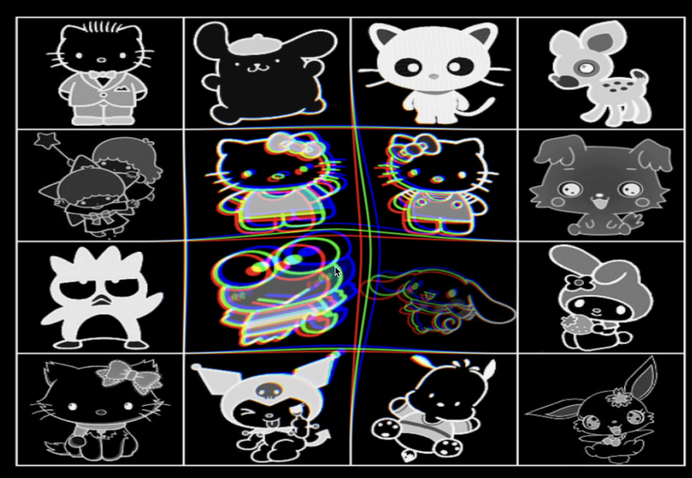

<!-- Improved compatibility of back to top link: See: https://github.com/othneildrew/Best-README-Template/pull/73 -->
<a name="readme-top"></a>
<!--
*** Thanks for checking out the Best-README-Template. If you have a suggestion
*** that would make this better, please fork the repo and create a pull request
*** or simply open an issue with the tag "enhancement".
*** Don't forget to give the project a star!
*** Thanks again! Now go create something AMAZING! :D
-->


<!-- PROJECT SHIELDS -->
<!--
*** I'm using markdown "reference style" links for readability.
*** Reference links are enclosed in brackets [ ] instead of parentheses ( ).
*** See the bottom of this document for the declaration of the reference variables
*** for contributors-url, forks-url, etc. This is an optional, concise syntax you may use.
*** https://www.markdownguide.org/basic-syntax/#reference-style-links
-->


<!-- PROJECT LOGO -->
<br />
<div align="center">
  <a href="#">
    
  </a>

  <h3 align="center">Lunar Gala Demo</h3>

  <p align="center">
    These are some demos for the Lunar Gala website, where each of the demos will be used for a specific page.
  </p>
</div>


### Built With

This section should list any major frameworks/libraries used to bootstrap your project. Leave any add-ons/plugins for the acknowledgements section. Here are a few examples.

* [![React][React.js]][React-url]
* [![Three][Three.js]][Three-url]


<!-- GETTING STARTED -->
## Getting Started

To execute the project, follow these instructions:


### Installation


1. Install Node.js at [https://nodejs.org/en/](node.js)
2. Clone the repo
   ```sh
   git clone https://github.com/csong2023/lunargalademo.git
   ```
3. Install NPM packages
   ```sh
   npm install
   ```
4. Run the code!
   ```sh
   npm run dev
   ```

<p align="right">(<a href="#readme-top">back to top</a>)</p>


<!-- MARKDOWN LINKS & IMAGES -->
<!-- https://www.markdownguide.org/basic-syntax/#reference-style-links -->

[React.js]: https://img.shields.io/badge/React-20232A?style=for-the-badge&logo=react&logoColor=61DAFB
[React-url]: https://reactjs.org/
[Three.js]: https://camo.githubusercontent.com/910e20b52408beae57b2a6cd38022f6aba900989afd80e3fb6a45f5643e7d102/68747470733a2f2f696d672e736869656c64732e696f2f7374617469632f76313f7374796c653d666f722d7468652d6261646765266d6573736167653d54687265652e6a7326636f6c6f723d303030303030266c6f676f3d54687265652e6a73266c6f676f436f6c6f723d464646464646266c6162656c3d
[Three-url]: https://threejs.org/